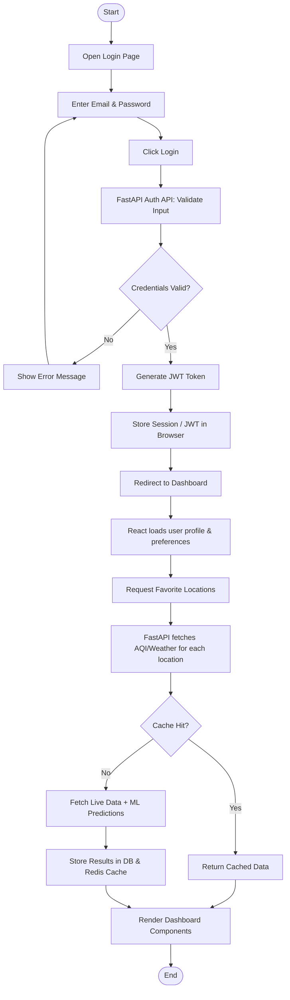

```mermaid

flowchart TD
    %% Start
    A([Start]) --> B[Open Login Page]

    %% User enters credentials
    B --> C[Enter Email & Password]
    C --> D[Click Login]

    %% Backend validation
    D --> E[FastAPI Auth API: Validate Input]
    E --> F{Credentials Valid?}

    %% Invalid case
    F -- No --> G[Show Error Message]
    G --> C

    %% Valid case
    F -- Yes --> H[Generate JWT Token]
    H --> I[Store Session / JWT in Browser]
    I --> J[Redirect to Dashboard]

    %% Dashboard Loading process
    J --> K[React loads user profile & preferences]
    K --> L[Request Favorite Locations]
    L --> M[FastAPI fetches AQI/Weather for each location]

    %% Caching logic
    M --> N{Cache Hit?}
    N -- Yes --> O[Return Cached Data]
    N -- No --> P[Fetch Live Data + ML Predictions]
    P --> Q[Store Results in DB & Redis Cache]

    %% Render UI
    O --> R[Render Dashboard Components]
    Q --> R

    R --> S([End])
```