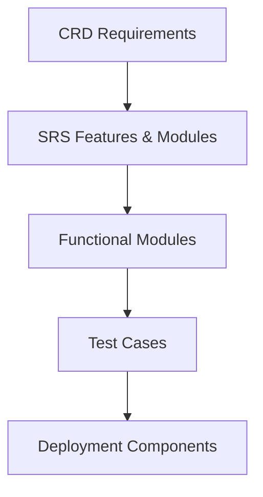
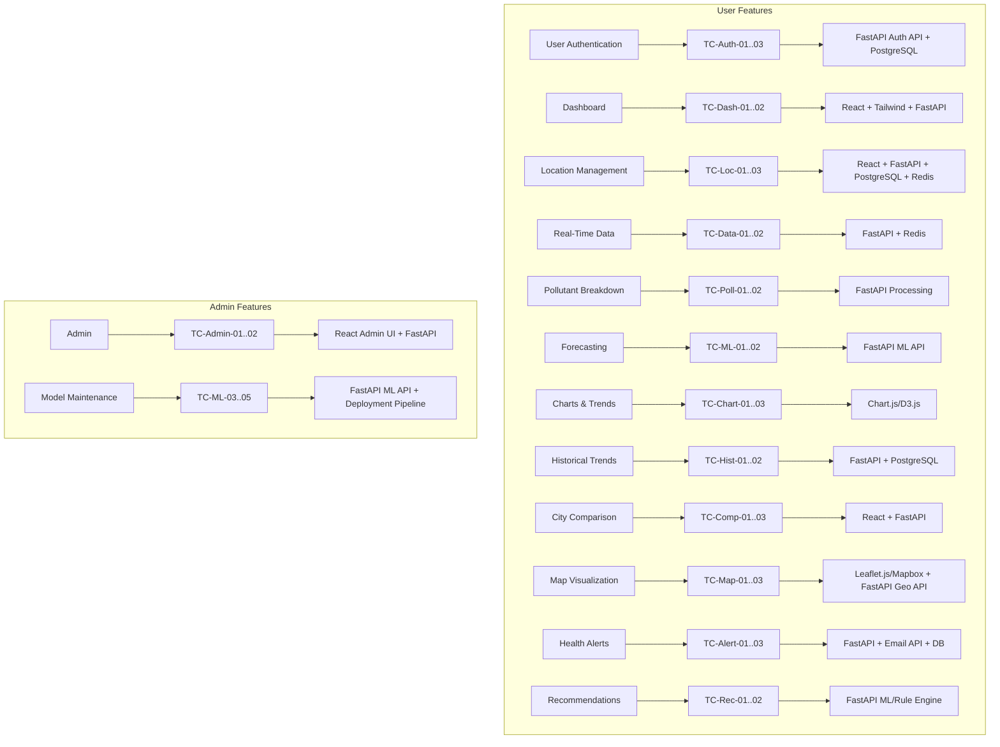
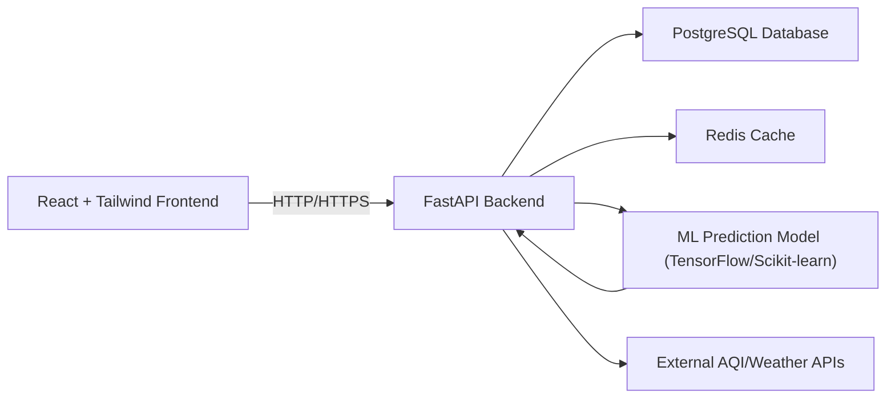
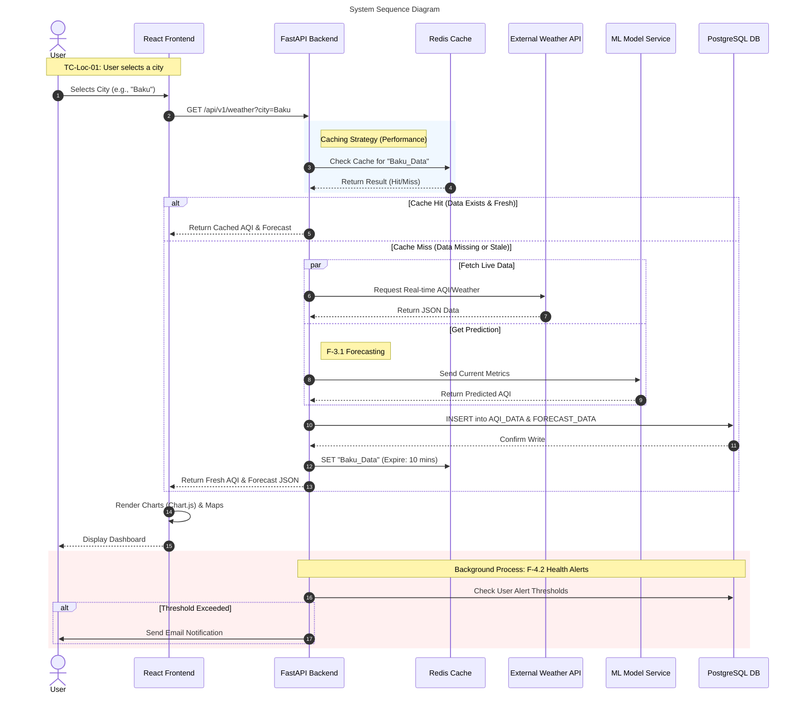
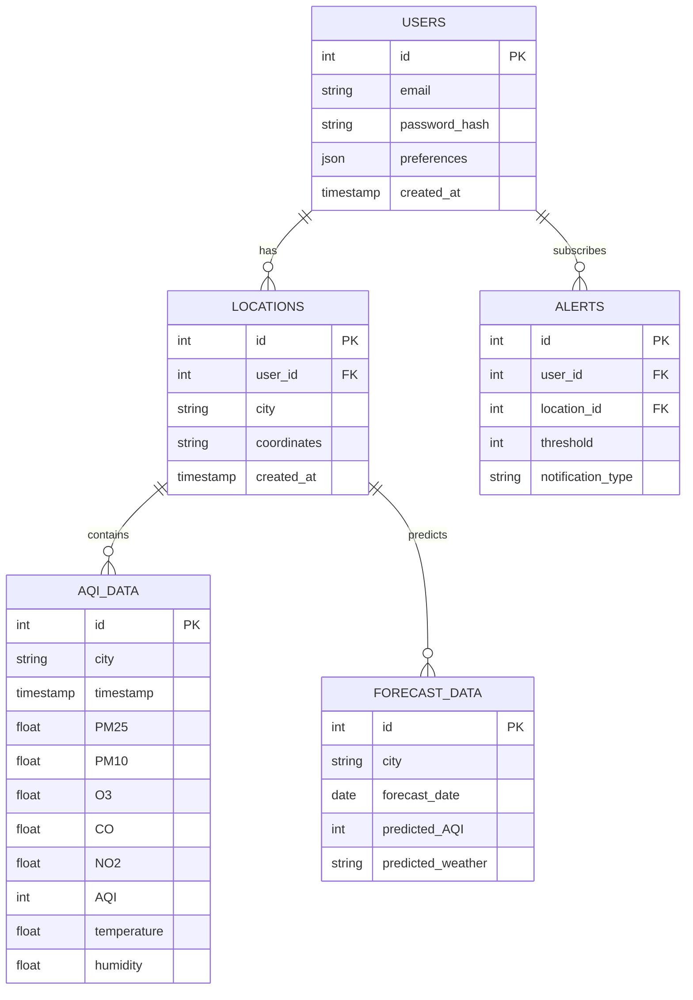
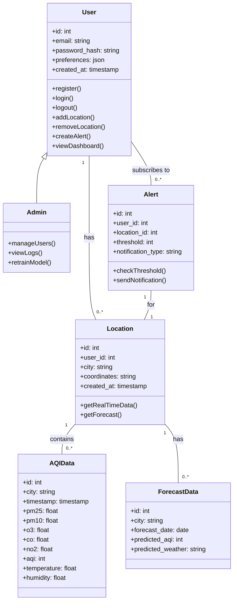
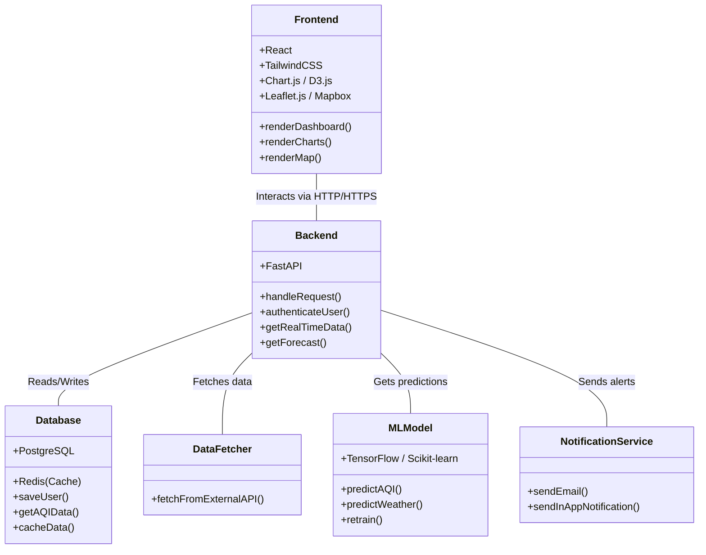
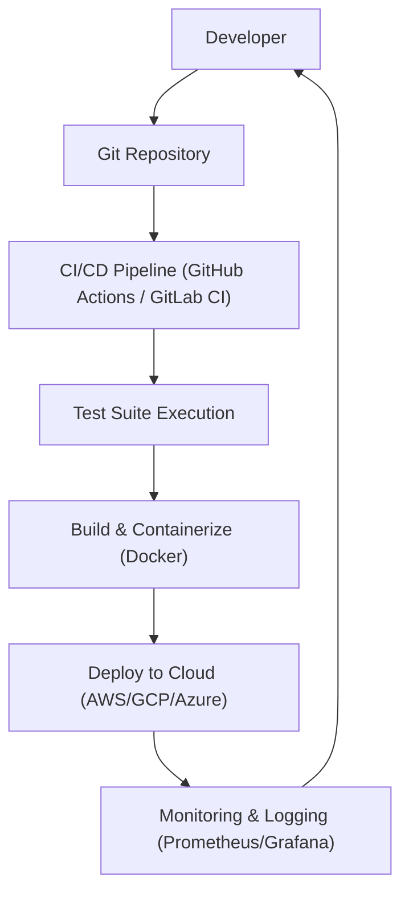

# Weather Pollution Analyzer & Predictor Web Application (WPA WebApp)

**SDLC Documentation Pack**
**Version:** 1.1
**Date:** 2025-10-17

---

## Table of Contents

- [Weather Pollution Analyzer \& Predictor Web Application (WPA WebApp)](#weather-pollution-analyzer--predictor-web-application-wpa-webapp)
  - [Table of Contents](#table-of-contents)
  - [1. Customer Requirements Document (CRD) Summary](#1-customer-requirements-document-crd-summary)
  - [2. Software Requirements Specification (SRS) Summary](#2-software-requirements-specification-srs-summary)
  - [3. SDLC Traceability Matrix](#3-sdlc-traceability-matrix)
  - [4. Visual SDLC Traceability Diagram](#4-visual-sdlc-traceability-diagram)
  - [5. High-Level System Architecture](#5-high-level-system-architecture)
  - [6. Database Schema Overview](#6-database-schema-overview)
  - [7. UML Class Diagrams](#7-uml-class-diagrams)
    - [Domain Model Class Diagram](#domain-model-class-diagram)
    - [System Components and Services Diagram](#system-components-and-services-diagram)
  - [8. Development Roadmap](#8-development-roadmap)
    - [Phase 1: Minimum Viable Product (MVP)](#phase-1-minimum-viable-product-mvp)
    - [Phase 2: V1.1 Release](#phase-2-v11-release)
    - [Phase 3: V1.2 Release](#phase-3-v12-release)
    - [Future Enhancements (Post-V1.2)](#future-enhancements-post-v12)
  - [9. API Endpoint Documentation](#9-api-endpoint-documentation)
  - [10. Testing Strategy](#10-testing-strategy)
    - [10.1 Unit Testing](#101-unit-testing)
    - [10.2 Integration Testing](#102-integration-testing)
    - [10.3 End-to-End (E2E) Testing](#103-end-to-end-e2e-testing)
    - [10.4 Performance \& Load Testing](#104-performance--load-testing)
    - [10.5 Security Testing](#105-security-testing)
  - [11. Deployment \& CI/CD Pipeline](#11-deployment--cicd-pipeline)

---

## 1. Customer Requirements Document (CRD) Summary

**Project Goal:** Real-time AQI/weather insights, predictive analytics, historical trends, interactive maps, alerts & recommendations.

**Target Users:** General public, health-sensitive individuals, athletes, parents, researchers.

**Core Features:**

- Registration/Login
- Dashboard with real-time metrics
- Real-time data & pollutant breakdown
- Forecasting & historical trends
- City comparison
- Interactive AQI map
- Alerts & recommendations
- Admin management & ML model maintenance

> Full CRD: See [`WPA-CRD-002`](./WPA-CRD-002.md)

---

## 2. Software Requirements Specification (SRS) Summary

**Functional Modules:**

| Module               | Description                                      |
| -------------------- | ------------------------------------------------ |
| User Authentication  | Email/password login, JWT session management     |
| Dashboard            | Real-time AQI/weather metrics                    |
| Location Management  | Add/edit/delete favorite cities                  |
| Real-Time Data       | Fetch and display live AQI/weather metrics       |
| Pollutant Breakdown  | Visualize pollutant concentrations with severity |
| Forecasting          | 5–7 day predictive AQI & weather                 |
| Charts & Trends      | Interactive charts with historical data          |
| City Comparison      | Compare metrics for multiple cities              |
| Map Visualization    | Interactive map showing AQI hotspots             |
| Health Alerts        | Threshold-based notifications via email/in-app   |
| Recommendations      | Personalized health/outdoor activity advice      |
| Admin Panel          | Manage users, logs, API usage                    |
| ML Model Maintenance | Retrain & redeploy predictive ML models          |

**Non-Functional Requirements:**

- Response time: ≤ 1s
- Page load: ≤ 3s
- Uptime: ≥ 99.9%
- Scalable up to 10,000 concurrent users
- Fully responsive (mobile/desktop)
- Security: HTTPS, bcrypt, JWT, RBAC
- Accessibility: WCAG 2.1 Level AA

> Full SRS: See [`WPA-SRS-001`](./WPA-SRS-001.md)

---

## 3. SDLC Traceability Matrix

| CRD ID | SRS Feature/Module  | Functional Module     | Test Case                                                                                                 | Deployment Component                     |
| ------ | ------------------- | --------------------- | --------------------------------------------------------------------------------------------------------- | ---------------------------------------- |
| F-1.1  | User Authentication | Registration/Login    | TC-Auth-01: Register   TC-Auth-02: Login   TC-Auth-03: JWT expiry                                   | FastAPI Auth API, PostgreSQL users table |
| F-1.2  | Dashboard           | Dashboard UI          | TC-Dash-01: Display metrics   TC-Dash-02: Responsive layout                                            | React + Tailwind, FastAPI endpoints      |
| F-2.1  | Location Management | Location CRUD         | TC-Loc-01: Add city   TC-Loc-02: Edit/Delete   TC-Loc-03: Device location                           | React + FastAPI + PostgreSQL + Redis     |
| F-2.2  | Real-Time Data      | Data Fetching         | TC-Data-01: Fetch data   TC-Data-02: Validate API                                                      | FastAPI + Redis                          |
| F-2.3  | Pollutant Breakdown | Data Processing       | TC-Poll-01: Compute pollutant severity   TC-Poll-02: Color-coded indicators                            | FastAPI Processing Module                |
| F-3.1  | Forecasting         | ML Prediction         | TC-ML-01: Predict AQI   TC-ML-02: Validate accuracy                                                    | FastAPI ML API, TensorFlow/Scikit-learn  |
| F-3.2  | Interactive Charts  | Chart Rendering       | TC-Chart-01: AQI trends   TC-Chart-02: Hover/zoom   TC-Chart-03: Filter                             | Chart.js/D3.js Frontend                  |
| F-3.3  | Historical Trends   | Historical Data UI    | TC-Hist-01: Display trends   TC-Hist-02: Date filtering                                                | FastAPI + PostgreSQL                     |
| F-3.4  | City Comparison     | Comparison Tool       | TC-Comp-01: Select multiple cities   TC-Comp-02: Side-by-side metrics   TC-Comp-03: Validate charts | React + FastAPI                          |
| F-4.1  | Map Visualization   | Interactive Map       | TC-Map-01: AQI hotspots   TC-Map-02: Zoom/pan/filter                                                   | Leaflet.js/Mapbox + FastAPI Geo API      |
| F-4.2  | Health Alerts       | Alert System          | TC-Alert-01: Subscribe   TC-Alert-02: Receive notifications   TC-Alert-03: Unsubscribe              | FastAPI + Email API + DB                 |
| F-4.3  | Recommendations     | Recommendation Engine | TC-Rec-01: Generate advice   TC-Rec-02: Display recommendations                                        | FastAPI ML/Rule Engine                   |
| F-5.1  | Admin Management    | Admin Panel           | TC-Admin-01: Manage users   TC-Admin-02: Monitor logs/API                                              | React Admin UI + FastAPI                 |
| F-5.2  | Model Maintenance   | ML Model Retraining   | TC-ML-03: Retrain model   TC-ML-04: Redeploy   TC-ML-05: Validate accuracy                          | FastAPI ML API + Deployment Pipeline     |

---

## 4. Visual SDLC Traceability Diagram

**Detailed User & Admin Feature Mapping**

---

## 5. High-Level System Architecture

**5.1. Component Interaction Diagram**

**5.2. User Login and Dashboard Data Flow**

**5.3. System Sequence Diagram**

---

## 6. Database Schema Overview

---

## 7. UML Class Diagrams

### Domain Model Class Diagram

This diagram illustrates the main entities of the system and their relationships.

### System Components and Services Diagram

This diagram shows the high-level components and services of the application and their interactions.

---

## 8. Development Roadmap

This section outlines a high-level, phased roadmap for the development of the WPA WebApp.

### Phase 1: Minimum Viable Product (MVP)
The goal of this phase is to deliver the core functionality that allows users to get immediate value from the application.
- **User Authentication:** Secure user registration and login (F-1.1, F-1.2).
- **Personalized Dashboard:** A simple dashboard displaying real-time weather and AQI data for a user's primary location (F-1.3).
- **Real-Time Data & Forecasting:** Integration with external APIs to fetch and display live data and a 5-7 day forecast (F-2.2, F-3.1).
- **Interactive Map:** A map view showing AQI data for the surrounding area (F-4.1).

### Phase 2: V1.1 Release
This phase focuses on enhancing user customization and data interaction features.
- **Location Management:** Allow users to add, edit, and delete multiple favorite locations (F-2.1).
- **Interactive Charts & Historical Trends:** Introduce dynamic charts for exploring historical data (F-3.2, F-3.3).
- **City Comparison:** A tool for users to compare AQI and weather metrics between two or more cities (F-3.4).
- **Pollutant Breakdown:** Detailed view of pollutant levels and their severity (F-2.3).

### Phase 3: V1.2 Release
This phase introduces proactive features and administrative controls.
- **Health Alerts:** A system for sending automated email or in-app notifications based on user-defined AQI thresholds (F-4.2).
- **Personalized Recommendations:** A rule-based engine to provide health and activity advice (F-4.3).
- **Admin Panel:** A secure interface for administrators to manage users and view system logs (F-5.1).

### Future Enhancements (Post-V1.2)
- **Advanced ML Model Maintenance:** Tools for admins to trigger model retraining and deployment (F-5.2).
- **Enhanced User Preferences:** More granular control over notifications, themes, and data display.
- **Data Export:** Allow users, particularly researchers, to export historical data.

---

## 9. API Endpoint Documentation

The following is a preliminary specification for the WPA WebApp's RESTful API.

| Endpoint                             | Method | Description                                     | Request Body (JSON)                        | Success Response (200 OK)                               |
| ------------------------------------ | ------ | ----------------------------------------------- | ------------------------------------------ | ------------------------------------------------------- |
| `/api/v1/auth/register`              | POST   | Register a new user.                            | `{ "email": "...", "password": "..." }`    | `{ "user_id": 1, "email": "..." }`                      |
| `/api/v1/auth/login`                 | POST   | Authenticate a user and receive a JWT.          | `{ "email": "...", "password": "..." }`    | `{ "access_token": "...", "token_type": "bearer" }`     |
| `/api/v1/users/me`                   | GET    | Get the current authenticated user's profile.   | (None)                                     | `{ "user_id": 1, "email": "...", "preferences": {} }`   |
| `/api/v1/locations`                  | GET    | Get a list of the user's saved locations.       | (None)                                     | `[{ "id": 1, "city": "Baku" }, ...]`                     |
| `/api/v1/locations`                  | POST   | Add a new location to the user's favorites.     | `{ "city": "Baku", "coordinates": "..." }` | `{ "id": 1, "city": "Baku" }`                           |
| `/api/v1/locations/{id}`             | DELETE | Remove a location from the user's favorites.    | (None)                                     | `{ "status": "success" }`                               |
| `/api/v1/data/realtime`              | GET    | Get real-time AQI and weather for a city.       | `?city=Baku` (Query Param)                 | `{ "city": "Baku", "aqi": 75, "temperature": 25, ... }` |
| `/api/v1/data/forecast`              | GET    | Get the 7-day forecast for a city.              | `?city=Baku` (Query Param)                 | `[{ "date": "...", "predicted_aqi": 80 }, ...]`          |
| `/api/v1/data/historical`            | GET    | Get historical data for a city.                 | `?city=Baku&range=30d` (Query Param)     | `[{ "timestamp": "...", "aqi": 70 }, ...]`              |
| `/api/v1/alerts`                     | POST   | Create a new alert threshold for a location.    | `{ "location_id": 1, "threshold": 100 }` | `{ "id": 1, "threshold": 100 }`                        |
| `/api/v1/alerts/{id}`                | DELETE | Delete a user's alert.                          | (None)                                     | `{ "status": "success" }`                               |
| `/api/v1/admin/users`                | GET    | **[Admin]** Get a list of all users.            | (None)                                     | `[{ "user_id": 1, "email": "..." }, ...]`                |
| `/api/v1/admin/models/retrain`       | POST   | **[Admin]** Trigger the ML model retraining.    | `{}`                                       | `{ "status": "retraining_started" }`                    |

---

## 10. Testing Strategy

A multi-layered testing strategy will be employed to ensure application quality, reliability, and performance.

### 10.1 Unit Testing
- **Backend (Python/FastAPI):** Unit tests will be written using the `pytest` framework. Key business logic, utility functions, and individual API endpoint logic (without external dependencies) will be tested. Test coverage will be monitored.
- **Frontend (React):** Components will be tested using `Jest` and `React Testing Library`. Tests will verify that components render correctly, manage their state, and handle user interactions as expected.

### 10.2 Integration Testing
- Integration tests will focus on the interaction between different parts of the system. This includes testing the full request/response cycle from the FastAPI backend to the PostgreSQL database and Redis cache.
- The connection and data transformation from external AQI/Weather APIs will also be covered.

### 10.3 End-to-End (E2E) Testing
- E2E tests will simulate real user workflows in a production-like environment.
- A framework like `Cypress` or `Playwright` will be used to write scripts that perform actions such as user registration, logging in, adding a location, and verifying that the dashboard displays the correct data.

### 10.4 Performance & Load Testing
- To ensure compliance with non-functional requirements (P-1, P-3), performance testing will be conducted using tools like `JMeter` or `Locust`.
- Scenarios will be created to simulate up to 10,000 concurrent users to test API response times, database performance, and system scalability.

### 10.5 Security Testing
- **Vulnerability Scanning:** Automated tools will be used to scan for common vulnerabilities (e.g., OWASP Top 10) and outdated dependencies.
- **Penetration Testing:** Manual or automated penetration testing will be performed to identify potential security holes in the authentication system, API, and infrastructure.
- **Code Review:** All code will be peer-reviewed with a focus on security best practices.

---

## 11. Deployment & CI/CD Pipeline

**Deployment Notes:**

- Backend and ML services containerized with **Docker**
- Frontend deployed to **CDN / Static Hosting**
- CI/CD automates **test → build → deploy**
- Monitoring ensures uptime, API health, and alert delivery

---
