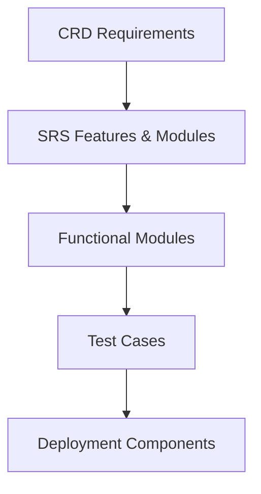
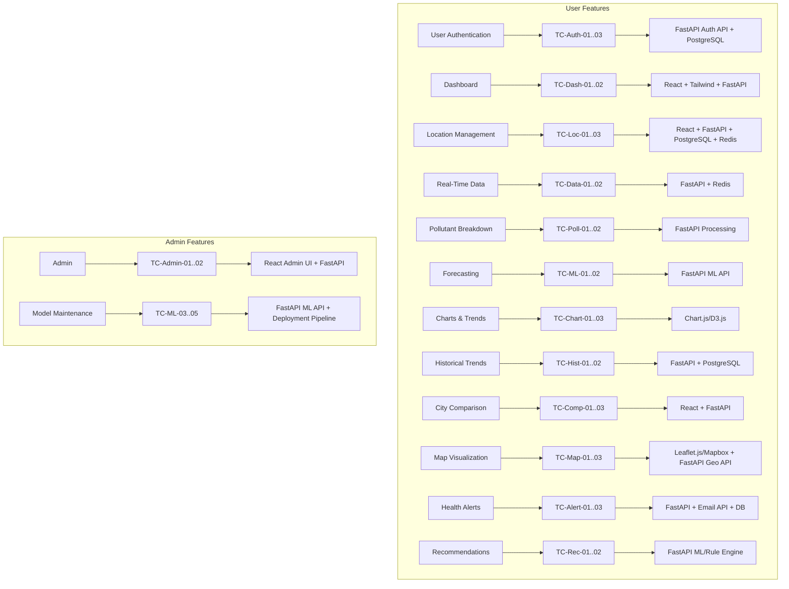
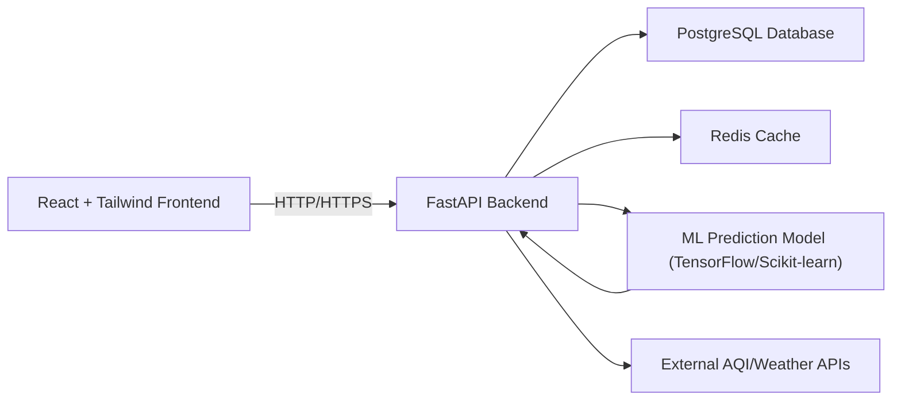
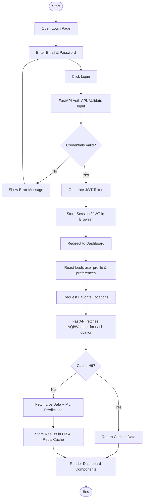
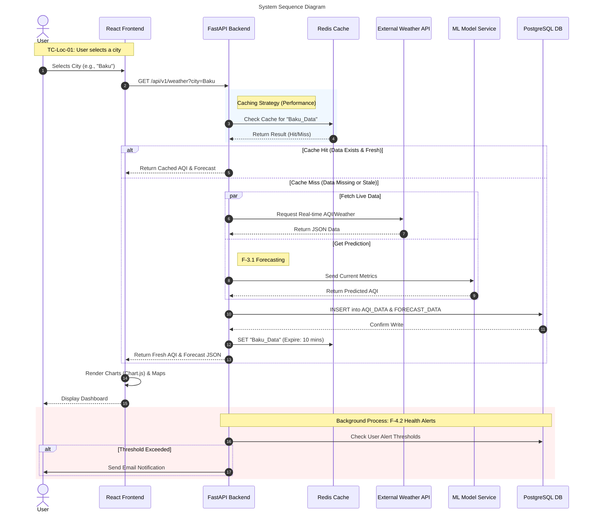
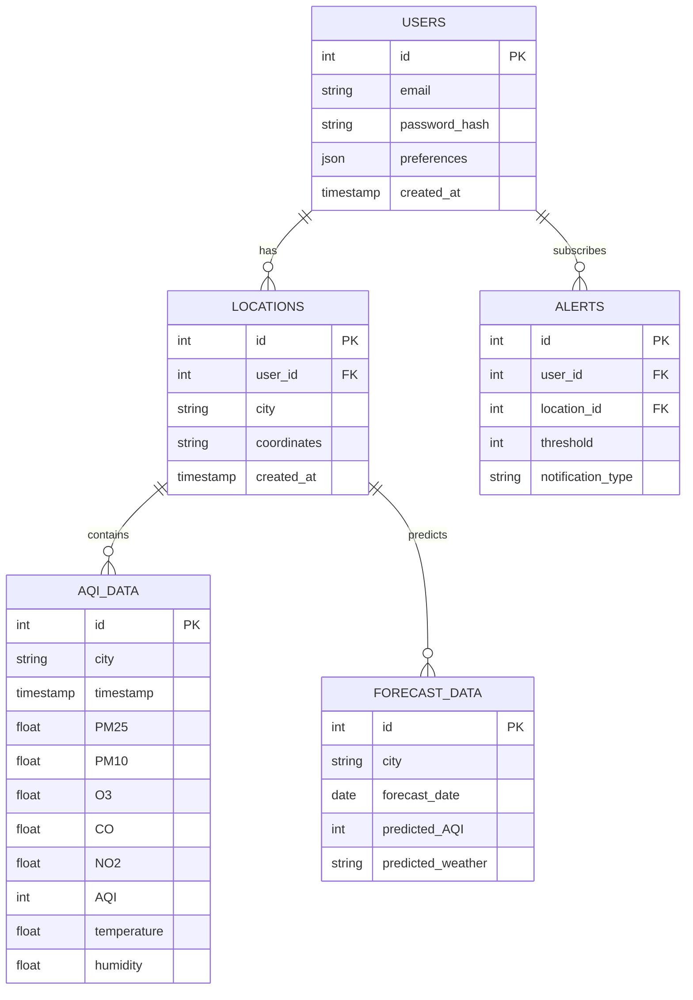
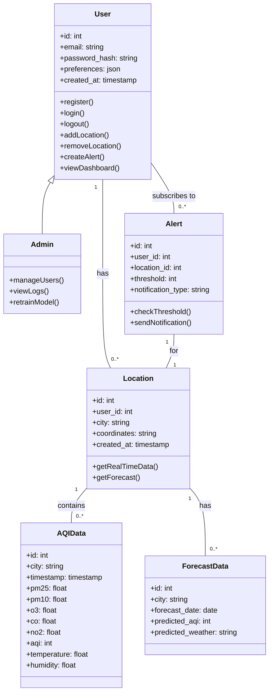
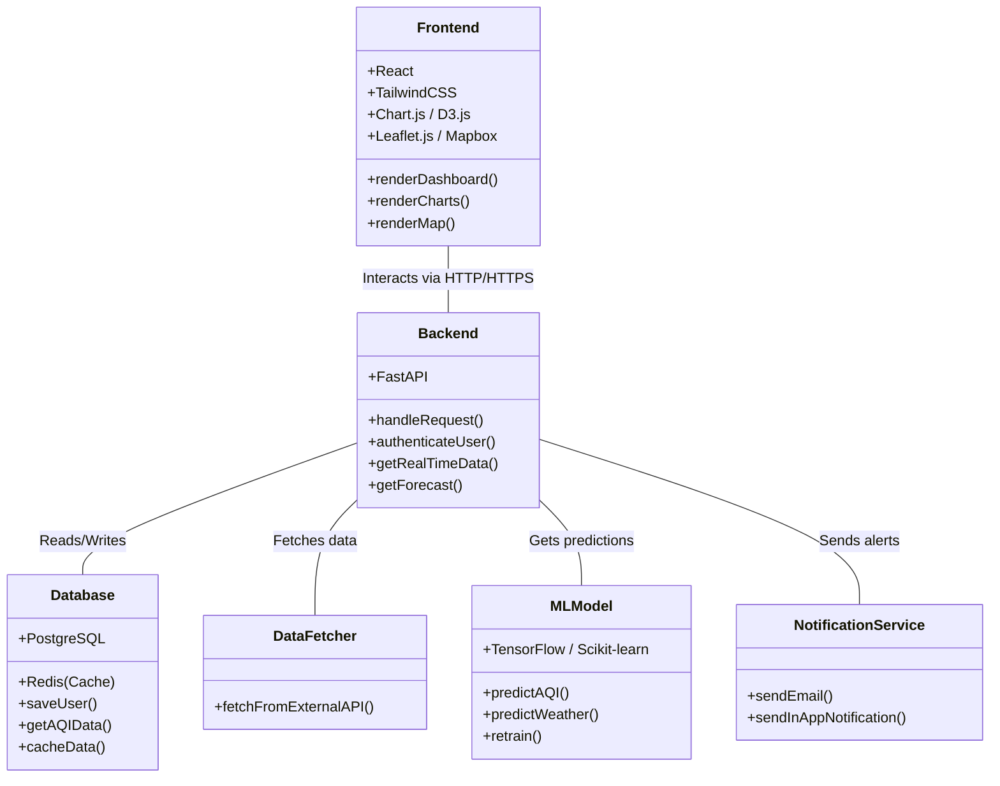
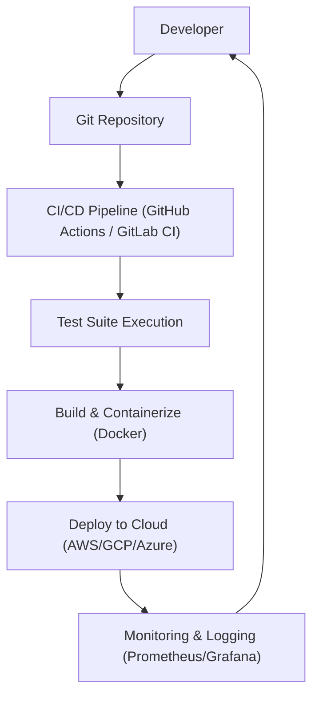

# Weather Pollution Analyzer & Predictor Web Application (WPA WebApp)

**SDLC Documentation Pack**
**Version:** 1.0
**Date:** 2025-10-16

---

## Table of Contents

1. [Customer Requirements Document (CRD) Summary](#crd-summary)
2. [Software Requirements Specification (SRS) Summary](#srs-summary)
3. [SDLC Traceability Matrix](#traceability-matrix)
4. [Visual SDLC Traceability Diagram](#traceability-diagram)
5. [High-Level System Architecture](#system-architecture)
6. [Database Schema Overview](#database-schema)
7. [UML Class Diagrams](#uml-class-diagrams)
8. [Deployment & CI/CD Pipeline](#deployment-ci-cd)

---

## 1. Customer Requirements Document (CRD) Summary

**Project Goal:** Real-time AQI/weather insights, predictive analytics, historical trends, interactive maps, alerts & recommendations.

**Target Users:** General public, health-sensitive individuals, athletes, parents, researchers.

**Core Features:**

- Registration/Login
- Dashboard with real-time metrics
- Real-time data & pollutant breakdown
- Forecasting & historical trends
- City comparison
- Interactive AQI map
- Alerts & recommendations
- Admin management & ML model maintenance

> Full CRD: See [`WPA-CRD-002`](./WPA-CRD-002.md)

---

## 2. Software Requirements Specification (SRS) Summary

**Functional Modules:**

| Module               | Description                                      |
| -------------------- | ------------------------------------------------ |
| User Authentication  | Email/password login, JWT session management     |
| Dashboard            | Real-time AQI/weather metrics                    |
| Location Management  | Add/edit/delete favorite cities                  |
| Real-Time Data       | Fetch and display live AQI/weather metrics       |
| Pollutant Breakdown  | Visualize pollutant concentrations with severity |
| Forecasting          | 5–7 day predictive AQI & weather                 |
| Charts & Trends      | Interactive charts with historical data          |
| City Comparison      | Compare metrics for multiple cities              |
| Map Visualization    | Interactive map showing AQI hotspots             |
| Health Alerts        | Threshold-based notifications via email/in-app   |
| Recommendations      | Personalized health/outdoor activity advice      |
| Admin Panel          | Manage users, logs, API usage                    |
| ML Model Maintenance | Retrain & redeploy predictive ML models          |

**Non-Functional Requirements:**

- Response time: ≤ 1s
- Page load: ≤ 3s
- Uptime: ≥ 99.9%
- Scalable up to 10,000 concurrent users
- Fully responsive (mobile/desktop)
- Security: HTTPS, bcrypt, JWT, RBAC
- Accessibility: WCAG 2.1 Level AA

> Full SRS: See [`WPA-SRS-001`](./WPA-SRS-001.md)

---

## 3. SDLC Traceability Matrix

| CRD ID | SRS Feature/Module  | Functional Module     | Test Case                                                                                                 | Deployment Component                     |
| ------ | ------------------- | --------------------- | --------------------------------------------------------------------------------------------------------- | ---------------------------------------- |
| F-1.1  | User Authentication | Registration/Login    | TC-Auth-01: Register   TC-Auth-02: Login   TC-Auth-03: JWT expiry                                   | FastAPI Auth API, PostgreSQL users table |
| F-1.2  | Dashboard           | Dashboard UI          | TC-Dash-01: Display metrics   TC-Dash-02: Responsive layout                                            | React + Tailwind, FastAPI endpoints      |
| F-2.1  | Location Management | Location CRUD         | TC-Loc-01: Add city   TC-Loc-02: Edit/Delete   TC-Loc-03: Device location                           | React + FastAPI + PostgreSQL + Redis     |
| F-2.2  | Real-Time Data      | Data Fetching         | TC-Data-01: Fetch data   TC-Data-02: Validate API                                                      | FastAPI + Redis                          |
| F-2.3  | Pollutant Breakdown | Data Processing       | TC-Poll-01: Compute pollutant severity   TC-Poll-02: Color-coded indicators                            | FastAPI Processing Module                |
| F-3.1  | Forecasting         | ML Prediction         | TC-ML-01: Predict AQI   TC-ML-02: Validate accuracy                                                    | FastAPI ML API, TensorFlow/Scikit-learn  |
| F-3.2  | Interactive Charts  | Chart Rendering       | TC-Chart-01: AQI trends   TC-Chart-02: Hover/zoom   TC-Chart-03: Filter                             | Chart.js/D3.js Frontend                  |
| F-3.3  | Historical Trends   | Historical Data UI    | TC-Hist-01: Display trends   TC-Hist-02: Date filtering                                                | FastAPI + PostgreSQL                     |
| F-3.4  | City Comparison     | Comparison Tool       | TC-Comp-01: Select multiple cities   TC-Comp-02: Side-by-side metrics   TC-Comp-03: Validate charts | React + FastAPI                          |
| F-4.1  | Map Visualization   | Interactive Map       | TC-Map-01: AQI hotspots   TC-Map-02: Zoom/pan/filter                                                   | Leaflet.js/Mapbox + FastAPI Geo API      |
| F-4.2  | Health Alerts       | Alert System          | TC-Alert-01: Subscribe   TC-Alert-02: Receive notifications   TC-Alert-03: Unsubscribe              | FastAPI + Email API + DB                 |
| F-4.3  | Recommendations     | Recommendation Engine | TC-Rec-01: Generate advice   TC-Rec-02: Display recommendations                                        | FastAPI ML/Rule Engine                   |
| F-5.1  | Admin Management    | Admin Panel           | TC-Admin-01: Manage users   TC-Admin-02: Monitor logs/API                                              | React Admin UI + FastAPI                 |
| F-5.2  | Model Maintenance   | ML Model Retraining   | TC-ML-03: Retrain model   TC-ML-04: Redeploy   TC-ML-05: Validate accuracy                          | FastAPI ML API + Deployment Pipeline     |

---

## 4. Visual SDLC Traceability Diagram

**Detailed User & Admin Feature Mapping**

---

## 5. High-Level System Architecture

**5.1. Component Interaction Diagram**

**5.2. User Login and Dashboard Data Flow**

**5.3. System Sequence Diagram**

---

## 6. Database Schema Overview

---

## 7. UML Class Diagrams

This document contains the UML class diagrams for the Weather Pollution Analyzer & Predictor Web Application (WPA WebApp).

### Domain Model Class Diagram

This diagram illustrates the main entities of the system and their relationships.

### System Components and Services Diagram

This diagram shows the high-level components and services of the application and their interactions.

---

## 8. Deployment & CI/CD Pipeline

**Deployment Notes:**

- Backend and ML services containerized with **Docker**
- Frontend deployed to **CDN / Static Hosting**
- CI/CD automates **test → build → deploy**
- Monitoring ensures uptime, API health, and alert delivery

---
