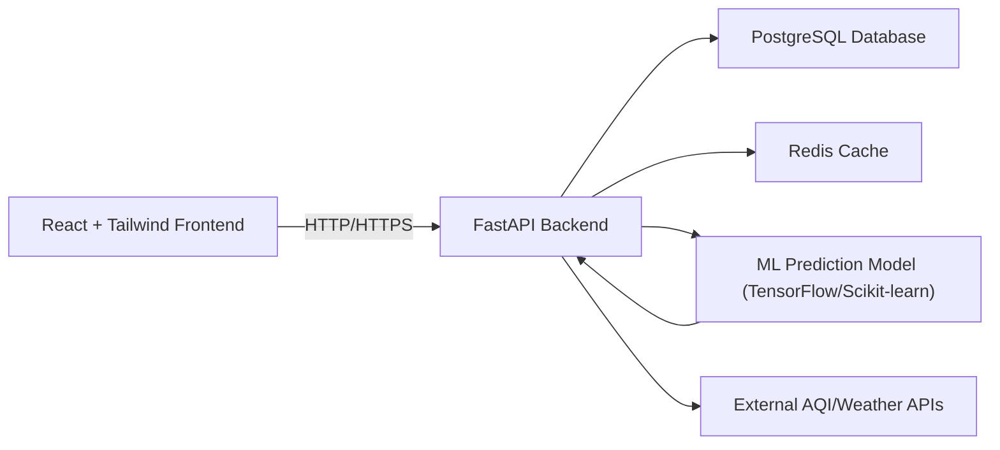

# Software Requirements Specification (SRS)

**Project:** Weather Pollution Analyzer and Predictor Web Application (WPA WebApp)
**Document ID:** WPA-SRS-001
**Version:** 1.0
**Date:** 2025-10-16
**Status:** Draft

---

## 1. Introduction

### 1.1 Purpose

This document defines the **software requirements** for the WPA WebApp, including functional and non-functional specifications, system architecture, and data handling. It serves as the primary reference for developers, testers, and stakeholders during the SDLC.

### 1.2 Scope

The WPA WebApp is a **responsive, data-driven web application** that provides:

- Real-time **AQI and weather monitoring**
- **Predictive analytics** for AQI and weather (5–7 day forecasts)
- **Historical trends and interactive visualizations**
- **City comparisons** and **interactive maps**
- **Automated alerts** based on user-defined thresholds
- **Personalized recommendations** for outdoor activities

The web app will support **user authentication**, **role-based administration**, and integration with **external APIs** for data collection.

### 1.3 Definitions, Acronyms, and Abbreviations

| Term | Definition                        |
| ---- | --------------------------------- |
| AQI  | Air Quality Index                 |
| ML   | Machine Learning                  |
| API  | Application Programming Interface |
| UI   | User Interface                    |
| JWT  | JSON Web Token                    |
| RBAC | Role-Based Access Control         |

### 1.4 References

- CRD Document: `WPA-CRD-002`
- FastAPI Documentation: [https://fastapi.tiangolo.com](https://fastapi.tiangolo.com)
- React + TailwindCSS Guidelines: [https://reactjs.org](https://reactjs.org), [https://tailwindcss.com](https://tailwindcss.com)
- AQI Data Sources: OpenAQ, World Air Quality Index Project
- World Bank Group: [https://data.worldbank.org/indicator?tab=featured](https://data.worldbank.org/indicator?tab=featured)
- Kaggle (Global Air Pollution Dataset): [https://www.kaggle.com/datasets/hasibalmuzdadid/global-air-pollution-dataset](https://www.kaggle.com/datasets/hasibalmuzdadid/global-air-pollution-dataset)
- Kaggle (Air Pollution Forecasting - LSTM Multivariate): [https://www.kaggle.com/datasets/rupakroy/lstm-datasets-multivariate-univariate](https://www.kaggle.com/datasets/rupakroy/lstm-datasets-multivariate-univariate)
- World Bank Group (Indicators Collection): [data.csv](transformed_data.csv)

---

## 2. Overall Description

### 2.1 Product Perspective

WPA WebApp is a **standalone web application** with client-server architecture:

- **Frontend:** React + TailwindCSS
- **Backend:** FastAPI (Python) with ML inference endpoints
- **Database:** PostgreSQL (user and preference data), Redis (caching)
- **External APIs:** Primary and backup AQI/weather data sources

### 2.2 Product Functions

- User registration and login
- Dashboard with real-time AQI/weather metrics
- Interactive charts and historical trends
- City comparison tools
- Interactive AQI map
- Alerts and recommendations
- Admin management of users, logs, and data

### 2.3 User Classes and Characteristics

| User Class   | Characteristics                | Privileges                                                 |
| ------------ | ------------------------------ | ---------------------------------------------------------- |
| General User | Tech-savvy, general public     | Dashboard, historical charts, map, alerts, recommendations |
| Admin        | Technical/system administrator | User management, logs, model retraining, API monitoring    |

### 2.4 Operating Environment

- Web browsers: Chrome, Firefox, Edge, Safari (latest versions)
- Devices: Desktop, tablet, mobile (fully responsive)
- Backend hosted on cloud platform with HTTPS support

### 2.5 Design & Implementation Constraints

- FastAPI backend with Python ML model integration
- React frontend with TailwindCSS styling
- PostgreSQL and Redis database usage
- Data source redundancy: automatic failover if API downtime >30s
- Prediction model accuracy: **R² ≥ 0.85**

---

## 3. Functional Requirements

| **ID**    | **Module**                 | **Description**                                                                                                                                              |
| :-------- | :------------------------- | :----------------------------------------------------------------------------------------------------------------------------------------------------------- |
| **F-1.1** | Onboarding                 | System shall allow a new user to register with an email and password.                                                                                        |
| **F-1.2** | Authentication             | System shall allow a returning user to log in and log out. Sessions will be managed via JWT.                                                                 |
| **F-1.3** | User Dashboard             | The system shall display a personalized dashboard summarizing key metrics (AQI, temperature, humidity, alerts).                                              |
| **F-2.1** | Location Management        | Users shall be able to add, edit, and delete favorite cities, or use their device’s current location.                                                        |
| **F-2.2** | Real-Time Data Retrieval   | The system shall fetch and display live AQI and weather metrics (e.g., PM2.5, PM10, O₃, CO, NO₂) for a selected location.                                     |
| **F-2.3** | Pollutant Breakdown        | The system shall display a breakdown of pollutants with color-coded severity indicators and explanations.                                                    |
| **F-3.1** | Forecasting                | The system shall provide 5–7 day predictive AQI and weather forecasts generated by an ML model.                                                              |
| **F-3.2** | Interactive Charts         | The system shall render dynamic charts for data visualization (e.g., AQI over time), supporting interactions like hover, zoom, and range selection.            |
| **F-3.3** | Historical Trends          | The system shall allow users to explore historical AQI and weather data over selectable time periods (e.g., weeks, months).                                    |
| **F-3.4** | City Comparison            | The system shall provide a feature to compare metrics for two or more cities side-by-side.                                                                   |
| **F-4.1** | Map Visualization          | The system shall display an interactive map with a real-time AQI overlay, showing pollution hotspots and regional differences.                               |
| **F-4.2** | Health Alerts              | The system shall send automated email or in-app notifications to users when the AQI in a selected location exceeds a user-defined threshold.                 |
| **F-4.3** | Recommendations            | The system shall generate and display personalized recommendations based on AQI forecasts and user health data.                                              |
| **F-5.1** | Admin Management           | The system shall provide an admin panel for managing users, viewing system logs, and monitoring API usage analytics.                                         |
| **F-5.2** | Model Maintenance          | The system shall allow administrators to trigger the retraining and redeployment of the predictive model.                                                    |

---

## 4. Non-Functional Requirements

### 4.1 Performance

- API latency ≤ 1 second
- Page load ≤ 3 seconds
- Auto-refresh live data every 5 minutes
- System scales up to 10,000 concurrent users

### 4.2 Security

- HTTPS/TLS encryption for all traffic
- Passwords hashed with bcrypt
- JWT session management
- RBAC for admin features
- Zero PII storage beyond login credentials

### 4.3 Usability

- Fully responsive UI
- Dark/light theme support
- Accessible (WCAG 2.1 Level AA)
- Interactive charts and maps

### 4.4 Reliability & Availability

- System uptime 99.9% (excluding maintenance)
- Data source failover within 30 seconds
- Backup database replication

---

## 5. System Architecture

### 5.1 High-Level Architecture

### 5.2 Data Flow

1. User requests data via dashboard or map
2. Backend queries real-time AQI/weather API
3. Data processed by ML model for forecasts
4. Data cached in Redis for performance
5. Frontend renders interactive charts, maps, and tables

---

## 6. Database Design (High-Level)

**Tables:**

- `users` (id, email, password_hash, preferences, created_at)
- `locations` (id, user_id, city, coordinates, created_at)
- `alerts` (id, user_id, location_id, threshold, notification_type)
- `aqi_data` (city, timestamp, PM2.5, PM10, O3, CO, NO2, AQI, temperature, humidity)
- `forecast_data` (city, forecast_date, predicted_AQI, predicted_weather)

---

## 7. External Interface Requirements

### 7.1 User Interfaces

- Web dashboard (React, Tailwind)
- Charts and graphs (Chart.js/D3.js)
- Maps (Leaflet.js/Mapbox)

### 7.2 APIs

- AQI/weather provider API (primary & backup)
- ML model endpoints (FastAPI inference API)
- Email notification API

---

## 8. System Features and Use Cases

1. **User Registration/Login**: Secure access with JWT
2. **Dashboard View**: Realtime metrics, interactive charts
3. **Forecast & Trends**: ML-based prediction, historical charts
4. **Map Visualization**: AQI overlay on interactive map
5. **Alerts**: Threshold-based notification system
6. **City Comparison**: Side-by-side metrics analysis
7. **Recommendations**: Health and activity suggestions
8. **Admin Management**: Logs, users, ML model retraining

---

## 9. Acceptance Criteria

- Functional modules must operate as specified
- ML predictions must meet **R² ≥ 0.85**
- System uptime ≥ 99.9%
- Responsive UI across all devices
- Alerts and notifications must be delivered reliably

---

## 10. Appendices

- External API documentation references
- ML model specification sheet
- UI wireframes and mockups

---
