# WPA WebApp SDLC Traceability & Diagram

**Project:** Weather Pollution Analyzer and Predictor Web Application
**Document ID:** WPA-TM-002
**Version:** 1.1
**Date:** 2025-10-16

---

## 1. Traceability Matrix

| **CRD ID** | **SRS Feature/Module** | **Functional Module** | **Test Case**                                                                                                                   | **Deployment Component**                                    |
| ---------- | ---------------------- | --------------------- | ------------------------------------------------------------------------------------------------------------------------------- | ----------------------------------------------------------- |
| F-1.1      | User Authentication    | Registration/Login    | TC-Auth-01: Register user with email/password   TC-Auth-02: Login with valid credentials   TC-Auth-03: JWT session expiry | Backend: FastAPI Auth API   DB: PostgreSQL users table   |
| F-1.2      | User Dashboard         | Dashboard UI          | TC-Dash-01: Display current AQI/Weather metrics   TC-Dash-02: Responsive layout verification                                 | Frontend: React + Tailwind   Backend: FastAPI endpoints  |
| F-2.1      | Location Management    | Location CRUD         | TC-Loc-01: Add favorite city   TC-Loc-02: Edit/Delete location   TC-Loc-03: Use device location                           | Frontend: Location UI   Backend: PostgreSQL + FastAPI    |
| F-2.2      | Real-Time Data         | Data Fetching         | TC-Data-01: Fetch real-time AQI/weather   TC-Data-02: Validate API response accuracy                                         | Backend: FastAPI   Cache: Redis                          |
| F-2.3      | Pollutant Breakdown    | Data Processing       | TC-Poll-01: Correct pollutant concentration calculation   TC-Poll-02: Display color-coded severity                           | Backend: FastAPI + Data Processing                          |
| F-3.1      | Forecasting            | ML Prediction         | TC-ML-01: Predict 5–7 day AQI   TC-ML-02: Validate R² ≥ 0.85                                                                 | Backend: FastAPI ML API   Model: TensorFlow/Scikit-learn |
| F-3.2      | Interactive Charts     | Chart Rendering       | TC-Chart-01: Render AQI trends   TC-Chart-02: Hover/zoom interactions   TC-Chart-03: Filter by pollutant                  | Frontend: Chart.js/D3.js                                    |
| F-3.3      | Historical Trends      | Historical Data UI    | TC-Hist-01: Display AQI trends over weeks/months   TC-Hist-02: Correct date filtering                                        | Backend: FastAPI   DB: PostgreSQL                        |
| F-3.4      | City Comparison        | Comparison Tool       | TC-Comp-01: Select multiple cities   TC-Comp-02: Display metrics side by side   TC-Comp-03: Validate chart correctness    | Frontend: React UI   Backend: FastAPI                    |
| F-4.1      | Map Visualization      | Interactive Map       | TC-Map-01: Display AQI map hotspots   TC-Map-02: Zoom/pan/filter functionality                                               | Frontend: Leaflet.js/Mapbox   Backend: FastAPI Geo API   |
| F-4.2      | Health Alerts          | Alert System          | TC-Alert-01: Subscribe to AQI threshold   TC-Alert-02: Receive email/in-app notification   TC-Alert-03: Unsubscribe       | Backend: FastAPI + Email API   DB: alerts table          |
| F-4.3      | Recommendations        | Recommendation Engine | TC-Rec-01: Generate health advice based on AQI   TC-Rec-02: Display personalized recommendations                             | Backend: FastAPI ML/Rule Engine                             |
| F-5.1      | Admin Management       | Admin Panel           | TC-Admin-01: View/manage users   TC-Admin-02: Monitor API usage/logs                                                         | Frontend: React Admin UI   Backend: FastAPI              |
| F-5.2      | Model Maintenance      | ML Model Retraining   | TC-ML-03: Retrain ML model with new data   TC-ML-04: Redeploy model   TC-ML-05: Validate prediction accuracy              | Backend: FastAPI ML API   Deployment Pipeline            |

---

## 2. Visual SDLC Traceability Diagram

```mermaid
flowchart TD
    CRD[CRD Requirements] --> SRS[SRS Features & Modules]
    SRS --> FM[Functional Modules]
    FM --> TC[Test Cases]
    TC --> DC[Deployment Components]

    subgraph "User Features"
        UA[User Authentication] --> TC1[TC-Auth-01..03]
        Dash[Dashboard] --> TC2[TC-Dash-01..02]
        Loc[Location Management] --> TC3[TC-Loc-01..03]
        RT[Real-Time Data] --> TC4[TC-Data-01..02]
        PB[Pollutant Breakdown] --> TC5[TC-Poll-01..02]
        FC[Forecasting] --> TC6[TC-ML-01..02]
        CH[Charts & Trends] --> TC7[TC-Chart-01..03]
        Hist[Historical Trends] --> TC8[TC-Hist-01..02]
        Comp[City Comparison] --> TC9[TC-Comp-01..03]
        Map[Map Visualization] --> TC10[TC-Map-01..03]
        Alerts[Health Alerts] --> TC11[TC-Alert-01..03]
        Rec[Recommendations] --> TC12[TC-Rec-01..02]
    end

    subgraph "Admin & System"
        Admin[Admin Panel] --> TC13[TC-Admin-01..02]
        ML[Model Maintenance] --> TC14[TC-ML-03..05]
    end

    TC1 --> DC1[FastAPI Auth API + PostgreSQL]
    TC2 --> DC2[React/Tailwind + FastAPI Endpoints]
    TC3 --> DC3[Frontend + PostgreSQL/Redis]
    TC4 --> DC4[FastAPI + Redis]
    TC5 --> DC5[FastAPI Processing Module]
    TC6 --> DC6[FastAPI ML API]
    TC7 --> DC7[Chart.js/D3.js Frontend]
    TC8 --> DC8[FastAPI + PostgreSQL]
    TC9 --> DC9[React + FastAPI]
    TC10 --> DC10[Leaflet.js/Mapbox + FastAPI Geo API]
    TC11 --> DC11[FastAPI + Email API + DB]
    TC12 --> DC12[FastAPI ML/Rule Engine]
    TC13 --> DC13[React Admin UI + FastAPI]
    TC14 --> DC14[FastAPI ML API + Deployment Pipeline]
```

---

### ✅ Notes:

1. This diagram **visually connects each CRD requirement → SRS feature → functional module → test case → deployment component**.
2. Mermaid.js can be rendered in **Markdown-supported editors**, **Confluence**, or **VSCode with Mermaid plugin**.
3. It supports easy updates whenever **requirements, test cases, or deployment details change**.
